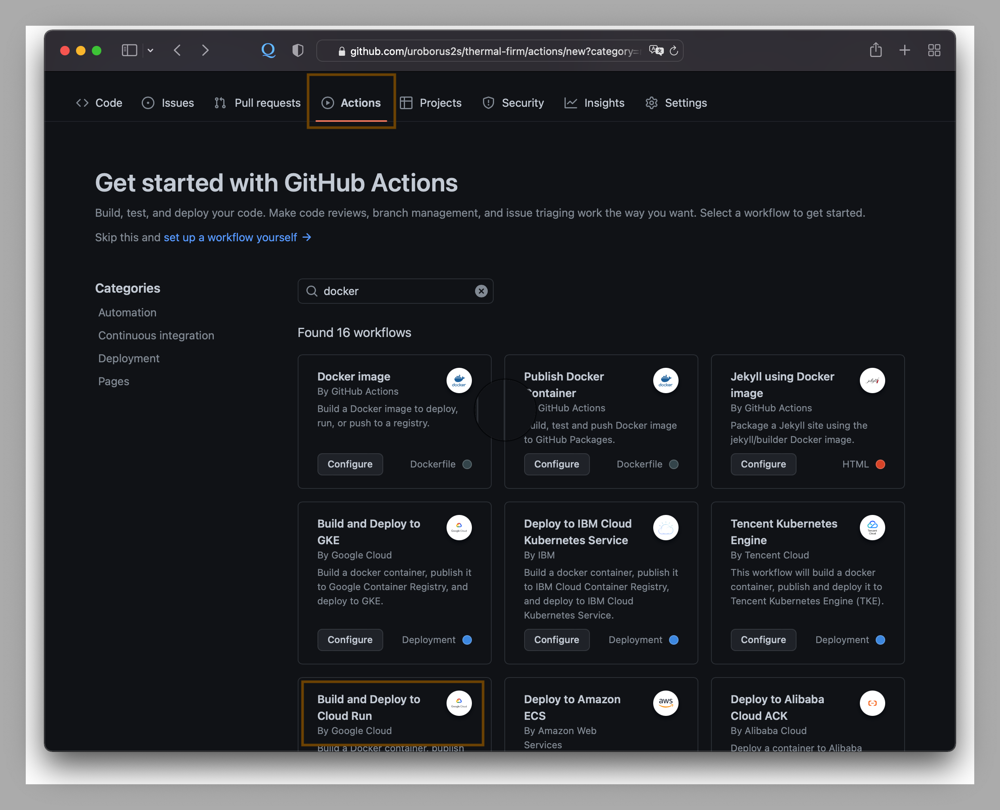
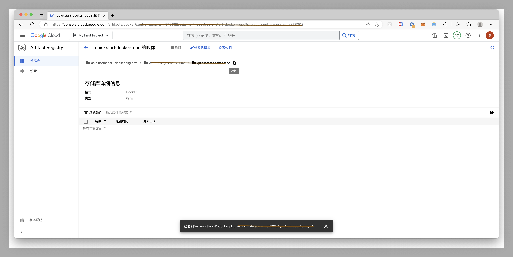
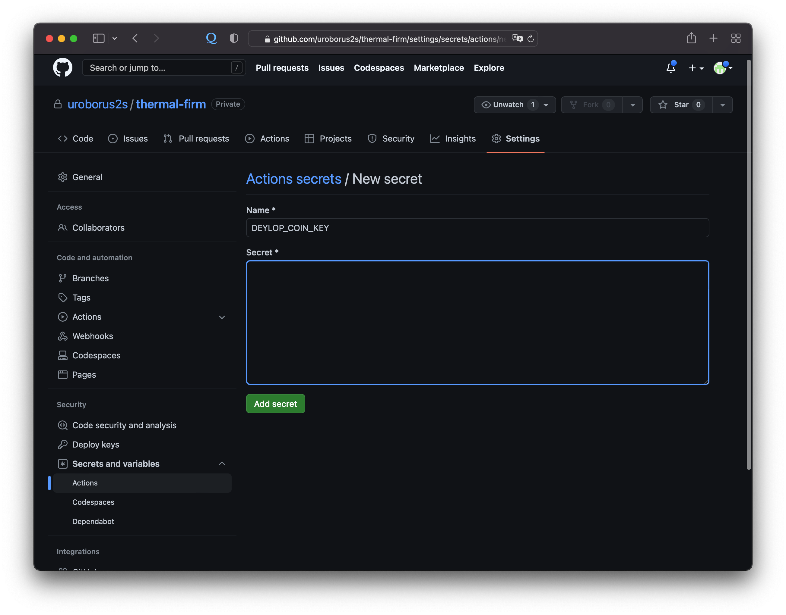
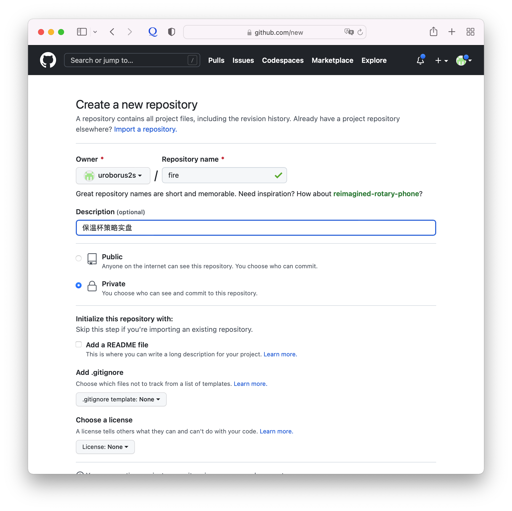
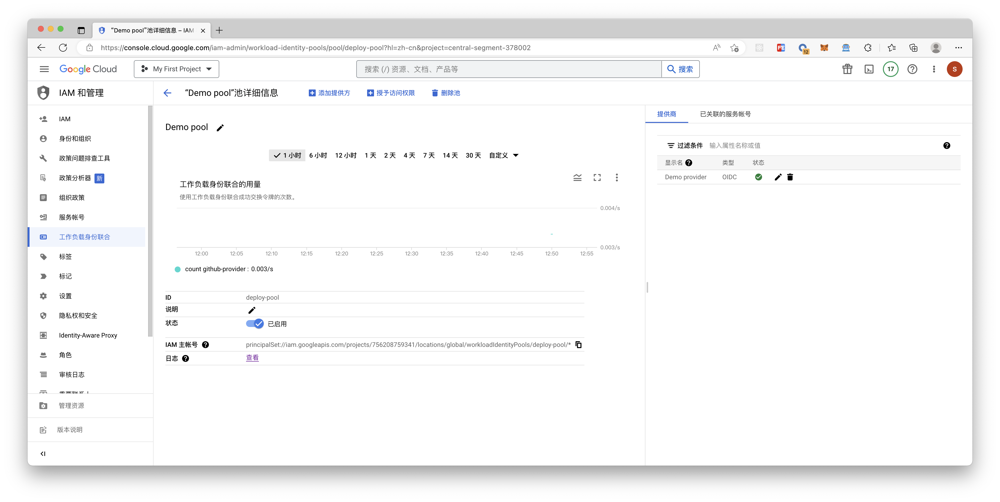

# 利用github Active 一键自动部署策略实盘程序(python)

# &emsp;写在前面

&emsp;&emsp;**动机**：修改代码后，更新程序到服务器并重新启动服务，虽然每次仅需要几分钟，但仍然劳心劳力，本文利用GitHub Active搭建简单的CI/CD的服务，持续自动部署化实盘程序到云服务器。<br>
<br>
&emsp;&emsp;**实现目的**：只需将代码提交到github，会触发工作流程打包代码并实时部署到云服务器。<br>
<br>
&emsp;&emsp;**实现原理**：本地代码提交到到github后，通过github active 触发工作流workflow，工作流获取源代码并打包成image镜像并提交到Google Artifact Registry 私有docker代码库，也可以提交到其他的docker镜像仓库，如docker hub，阿里等镜像仓库。github active通过远程ssh命令调用云服务器上的部署脚本，调用docker拉取镜像并重新部署运行服务<br>
<br>

## &emsp;前提条件
<br>

* 云服务器上已经安装 **[Docker Engine](https://docs.docker.com/engine/install "安装Docker Engine")**。
* 拥有 **[github](https://github.com)** 账号，熟悉基本的git操作。
* 开发机已安装git。
* 注册如下镜像容器服务的一种的账号（Docker Hub、GitHub Container Registry、GitLab、Azure Container Registry (ACR)、Google
  Container Registry (GCR)、Google Artifact Registry (GAR)、AWS Elastic Container Registry (ECR)、AWS Public Elastic
  Container Registry (ECR)、OCI Oracle Cloud Infrastructure Registry (OCIR)）
<br>
*******
## 需要完成的工作
<br>

### 1.创建github active工作流workflow的配置文件
<br>
&emsp;&emsp;由于文中使用Google Artifact Registry作为docker镜像仓库，因此workflow的基本步骤如下：
<br>

1. 对 Google Cloud 进行身份验证
2. 对 Artifact Registry 验证 Docker 容器
3. 构建一个 docker 容器
4. 将docker image发布到 Google Artifact Registry
5. 远程链接云服务器，并执行服务器上的deploy脚本
<br>

******

### 2.在云服务器上创建deploy.sh脚本
<br>
&emsp;&emsp;在云服务上拉取docker镜像，停止本机docker容器，并重新执行镜像，因为部署脚本基本步骤如下：
<br>

1. 从镜像仓库拉取指定名称的镜像
2. 暂停本机容器并删除容器
3. 重新运行镜像
4. 清除无用的镜像和容器
<br>

**************

### 3.编写Dockerfile打包程序
<br>
&emsp;&emsp;在云服务上拉取docker镜像，停止本机docker容器，并重新执行镜像，因为部署脚本基本步骤如下：
<br>

1. 从镜像仓库拉取指定名称的镜像
2. 暂停本机容器并删除容器
3. 重新运行镜像
4. 清除无用的镜像和容器
<br>

**************

# &emsp;开始干吧
<br>

## &emsp;一、打包docker image
### 首先修改代码避免将敏感信息提交到github
<br>
> 为了不将配置中的密码信息上传到git服务器上，使用python-dotenv包将敏感信息存放到.env文件中。<br>
> - 本地开发时，从.env中读取敏感信息。<br>
> - 云服务器端启动服务时，配置环境变量，启动服务后从环境变量获取敏感内容。<br>
> - 修改config.py文件以满足条件。

**第一步先下载python-dotenv包**
```bash
# 如果使用pipenv管理本地python环境
instance-1:~$ pipenv shell
instance-1:~$ pipenv install python-dotenv
instance-1:~$ pipenv requirements > requirements.txt

# pip方式安装
instance-1:~$ pip install python-dotenv
# 生成requirements.txt
instance-1:~$ pip freeze > requirements.txt
```

**第二步修改config.py文件**
<br>
```python
import os
import ccxt
from dotenv import load_dotenv

# 如果使用代理 注意替换IP和Port
if os.getenv('APP_ENV') == 'development':
    address = os.getenv('PROXY_ADDRESS')
    proxy = {'http': address, 'https': address}
else:
    proxy = {}
    
# 创建交易所
exchange = ccxt.binance({
    'apiKey': os.getenv('API_KEY'),
    'secret': os.getenv('SECRET'),
    'timeout': 30000,
    'rateLimit': 10,
    'enableRateLimit': False,
    'options': {
        'adjustForTimeDifference': True,
        'recvWindow': 10000,
    },
    'proxies': proxy
})

env = load_dotenv()

# =====钉钉配置
webhook = os.getenv('DING_WEBHOOK')  # 钉钉机器人的webhook
secret = os.getenv('DING_SECRET')  # 钉钉机器人的密钥

```
<br>

**第三步增加.env文件用于本地开发，注意.env不要提交到服务器，从git中忽略**
```ini
API_KEY=xx
SECRET=xx
DING_WEBHOOK=xx
DING_SECRET=xx
PROXY_ADRESS=xx
APP_ENV=development
```
-----
<br>
完成代码修改后，可编辑dockerfile文件后完成打包

### 然后在项目的根目录编写Dockerfile文件
<br>
构建分为两个步骤：<br>

1. 第一步先构建基础的python版本，文中构建版本为3.8.5版本。<br>
构建文件参考如下：

```dockerfile
FROM alpine:3.17

# ensure local python is preferred over distribution python
ENV PATH /usr/local/bin:$PATH

# http://bugs.python.org/issue19846
# > At the moment, setting "LANG=C" on a Linux system *fundamentally breaks Python 3*, and that's not OK.
ENV LANG C.UTF-8

# runtime dependencies
RUN set -eux; \
	apk add --no-cache \
		ca-certificates \
		tzdata \
	;

ENV GPG_KEY E3FF2839C048B25C084DEBE9B26995E310250568
ENV PYTHON_VERSION 3.8.5

# 省略具体打包方式，详细见Dockerfile

```

2. 第二步对应用进行构建
构建文件参入如下：
```dockerfile
WORKDIR /apps/thermal
COPY . .
RUN pip install -r requirements.txt
CMD ["python3", "./startup.py"]
```
<br>

---------
<br>

### 将.dockerignore拷贝在项目的根目录
<br>
&emsp;&emsp;设置 .dockerignore 文件能防止.github data、虚拟环境、git文件、编辑器文件以及其他中间构建产物被复制到镜像中导致构建问题。<br>
如下为参考文件,请根据需要忽略的文件情况修改

```docker
# Macos General
.DS_Store

.idea/
.git/
data/
books/
.github/
.gitignore

# Environments
.env/
.venv/
env/
venv/
ENV/
env.bak/
venv.bak/
```

<br>
## &emsp;二、编辑deploy.sh并上传到云服务上
<br>
在根目录生成deploy.sh文件，注意文件不要上传到github。

```shell
```

> 云服务器需要为 Docker 设置身份验证<br>
>   为访问Artifact Registry的设置[Docker 身份证](https://cloud.google.com/artifact-registry/docs/docker/authentication?hl=zh-cn)

<br>

### 3. 将deploy上传到云服务器，使工作流可以调用部署脚本

## &emsp;三、在项目创建 .github/workflows/ 目录并创建以.yml 结尾的workflow文件
<br>
创建 [Github Action](https://docs.github.com/zh/enterprise-server@3.8/actions/quickstart) 工作流程
<br>


### 1. 在存储库中，创建 .github/workflows/ 目录来存储工作流文件。
<br>

### 2. 在 .github/workflows/ 目录中，创建一个名以 .yml 结尾的新文件构建工作流程代码。
<br>

#### 文件基本内容

文件开头配置工作流基本信息，包括名称，触发条件以及工作流脚本中需要用到变量信息

```yaml
name: Build and Deploy with ssh Remote

on:
  push:
    branches: [ "main" ]
    paths-ignore:
      - 'books/**'
  workflow_dispatch:
    branches: [ "main" ]

env:
  PROJECT_ID: PROJECT_ID # TODO: update Google Cloud project id
  GAR_LOCATION: YOUR_GAR_LOCATION # TODO: update Artifact Registry location

jobs:
  deploy:
    # Add 'id-token' with the intended permissions for workload identity federation
    permissions:
      contents: 'read'
      id-token: 'write'

    runs-on: ubuntu-latest
    steps:
      - name: Checkout
        uses: actions/checkout@v3
```

基本信息详细说明：

<table><tr>
<td><div>

```yaml
name: Build and Deploy to Cloud Run
```
</div></td>
<td>可选 - 工作流的名称，它将显示在 GitHub 存储库的“操作”选项卡中。</td></tr>
<tr><td><div>

```yaml
on:
  push:
    branches: [ "main" ]
    paths-ignore:
      - 'books/**'
  workflow_dispatch:
    branches: [ "main" ]
```
</div></td>
<td>指定此工作流程的触发器。 此处使用 push 事件，因此每当有人将更改推送到存储库或合并拉取请求时都会触发工作流运行。 仅在main分支上生效，并且忽略books文件夹。</td></tr>
<tr><td><div>

```yaml
env:
```
</div></td>
<td>工作流中用到的变量</td></tr>
<tr><td><div>

```yaml
jobs:
```
</div></td>
<td>工作流中所有的作业定义。此处仅有一个作业deploy</td></tr>
<tr><td><div>

```yaml
runs-on: ubuntu-latest
```
</div></td>
<td>将作业配置为在最新版本的 Ubuntu Linux 运行器上运行。 </td></tr>
<tr><td><div>

```yaml
steps:
```
</div></td>
<td>作业中运行的所有步骤的定义。此部分下嵌套的每项都是一个单独的操作或 shell 脚本。</td></tr></table>

---------
<br>

#### 从github仓库中读取最新到源代码到构建服务中
<br>

将运行[actions/checkout](https://github.com/actions/checkout)库的v3版本。 这是一个将存储库签出到运行器上的操作，允许您对代码（如生成和测试工具）运行脚本或其他操作。 每当工作流程将针对存储库的代码运行时，都应使用签出操作。

```yaml
- name: Checkout
  uses: actions/checkout@v3
```

<br>

#### 由于文中采用google 云服务器，此步骤用于google 云服务器鉴权

将运行 [google-github-actions/auth](https://github.com/google-github-actions/auth#setup) 库的v3版本,向 Google Cloud 进行身份验证,支持Google 云服务帐户密钥（Google Cloud Service Account Key）和工作负载身份联合（[Workload Identity Federation](https://cloud.google.com/iam/docs/workload-identity-federation?hl=zh_CN)）两种验证方式。<br> 
谷歌云服务Workload Identity Federation配置见附录配置
```yaml
- name: Google Auth
  id: auth
  uses: 'google-github-actions/auth@v1'
  with:
    token_format: 'access_token'
    workload_identity_provider: 'projects/123456789/locations/global/workloadIdentityPools/my-pool/providers/my-provider' # e.g. - projects/123456789/locations/global/workloadIdentityPools/my-pool/providers/my-provider
    service_account: 'my-service-account@my-project.iam.gserviceaccount.com' # e.g. - my-service-account@my-project.iam.gserviceaccount.com
```
<br>

#### 执行docker build指令生成docker image，并将image推送到Google Artifact Registry (GAR)库
由于使用到使谷歌的镜像服务库，因此使用第二步鉴权的结果将打包的结果push到Google Artifact Registry(GAR)<br>
执行docker build指令生成docker image，并将image推送到Google Artifact Registry (GAR)库<br>
配置提交库的location和repo service,请先自行在GAR中创建docker镜像代码库
```yaml
GAR_LOCATION: asia-northeast1 # TODO: update Artifact Registry location
SERVICE: quickstart-docker-repo
```


在工作流中配置docker 打包和push操作
```yaml
- name: Build and Push Container
  run: |-
    docker build -t "${{ env.GAR_LOCATION }}-docker.pkg.dev/${{ env.PROJECT_ID }}/${{ env.SERVICE }}:${{ github.sha }}" ./
    docker push "${{ env.GAR_LOCATION }}-docker.pkg.dev/${{ env.PROJECT_ID }}/${{ env.SERVICE }}:${{ github.sha }}"
```
<br>

首先请确保已经创建Google Artifact Registry(GAR)代码库<br>
根据第二步等认证结果，向代码库进行身份验证<br>

如果未创建，请参考[推送和拉取映像](https://cloud.google.com/artifact-registry/docs/docker/pushing-and-pulling?hl=zh-CN) <br>

#### 通过ssh远程操作云服务调用部署脚本
将运行 [appleboy/ssh-action](https://github.com/appleboy/ssh-action) 库的0.1.7版本，执行服务器上的部署脚本。
```yaml
 - name: executing remote ssh commands using password
   uses: appleboy/ssh-action@v0.1.7
   with:
    host: ${{ secrets.DEPLOY_COIN_HOST }}
    username: ${{ secrets.DEPLOY_COIN_USERNAME }}
    key: ${{ secrets.DEPLOY_COIN_KEY }}
    script: whoami
```

使用ssh key方式连接到云服务，需要按照如下到步骤完成。

##### 步骤1、在本机生成RSA密钥对，支持Rsa或者ed25519两种模式
```shell
#Rsa
~: ssh-keygen -t rsa -b 4096 -C "your_email@example.com" -f ~/.ssh/active_rsa
#ed25519
~: ssh-keygen -t ed25519 -a 200 -C "your_email@example.com" -f ~/.ssh/active_rsa
```

###### 步骤2、将生成对 pubkey拷贝到云服务器
```shell
#Rsa
~: cat .ssh/active_rsa.pub | ssh -i .ssh/id_rsa user@192.168.1.1 'cat >> .ssh/authorized_keys'
#ed25519
~: cat .ssh/id_ed25519.pub | ssh user@192.168.1.1 'cat >> .ssh/authorized_keys'
```

###### 步骤三、将私钥用户名和host信息等信息配置到github actions的secret中

<br>

------
<br>

## &emsp;四、将代码提交到github
### 1. 在github上新建仓库
<br>

&emsp;&emsp;在github上新建仓库存放代码


### 2. 修改git默认分支名称

&emsp;&emsp;由于github远程仓库默认分支由 master 变更为 mian，修改本地git的配置

```
# 修改git init后生成的默认分支的名称为 main
instance-1:~$ git config --global init.defaultBranch main
```

### 3. 进入实盘代码文件夹，初始化本地仓库，并链接到github远程仓库

```
instance-1:~$ cd ${existing_folder}
instance-1:~$ git init
instance-1:~$ git remote add origin git@github.com:uroborus2s/thermal-firm.git
git add .
git commit -m "Initial commit"
git push -u origin main
```

-------
<br>

# FAQ
<br>

**push后返回 error: failed to push some refs to 'uroborus.github.com:uroborus2s/thermal-firm.git'**

&emsp;&emsp;新建的远程仓库中包含文件，和本地文件不同步导致，先合并文件,在重新提交

```
# 从远程仓库合并数据
instance-1:~$ git pull --rebase origin main
instance-1:~$ git add .
instance-1:~$ git git rebase --continue
instance-1:~$ git push -u origin main
```


# 附录-配置谷歌云服务
<br>

## 在谷歌云平台创建Artifact Registry代码库-docker私有仓库
### 1. 创建 Docker 代码库,创建 Docker 代码库以便存储github自动工作流打包的docker image。
### 2. 配置身份验证以便推送或拉取映像，请将 Docker 配置为使用 Google Cloud CLI 对向 Artifact Registry 的请求进行身份验证。
将创建代码库的区域 配置到github action 工作流的变量中，以便访问google Artifact Registry代码库
```yaml
GAR_LOCATION: asia-northeast1 # TODO: update Artifact Registry location
```

## 在谷歌云服务上创建workload identity federation 认证
已有google cloud 服务器
## 将谷歌云服务的project id配置到github 工作流配置文件中
```yaml
PROJECT_ID: ${PROJECT_ID} # TODO: update Google Cloud project id
```

## 查看如何[配置谷歌云平台工作负载身份联合](https://github.com/google-github-actions/auth#setting-up-workload-identity-federation)



